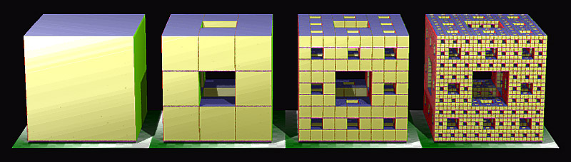

# CodeWars competitive

## Задачи 7kyu
 - Email Parser.   
 Напишите функцию, которая будет возращать email из строки.  
 Пример - 
  ```bash
  'Vasiliy Ivanov <ivanov@gmail.com>' -> 'ivanov@gmail.com'.
```
 - Find Short.   
 Напишите функцию, которая вернет длину самого короткого слово в строке.  
 - Menger Sponge.   
Куб C0 с ребром 1 делится плоскостями, параллельными его граням, на 27 равных кубов. Из куба C0 удаляются центральный куб и все прилежащие к нему по двумерным граням кубы этого подразделения. Получается множество C1, состоящее из 20 оставшихся замкнутых кубов «первого ранга». Поступая точно так же с каждым из кубов первого ранга, получим множество C2, состоящее из 400 кубов второго ранга. Продолжая этот процесс бесконечно, получим бесконечную последовательность.  
Напишите функцию, которая будет возвращать количество получивших кубов при определенно количестве разделений.   
```bash
expect(MengerCube(0)).toBe(1); expect(MengerCube(1)).toBe(20); expect(MengerCube(2)).toBe(400);
```

- Palindrom.  
Напишите функцию, которая проверяет является ли слово палиндромом.  
- Morse code.   
Напишите функцию, котоаря шифрует строку в код Морзе.  
## Задачи 6kyu
- Deep Array Count.  
Вам дан массив. Напишите функцию, которая возвращает количество ВСЕХ элементов в массиве, включая любые вложенные массивы.
- Find The Odd.  
Дан массив целых чисел, найдите то, которое встречается нечетное количество раз.
Всегда будет только одно целое число, которое встречается нечетное количество раз.
- Multiplies 3 & 5.  
Если мы перечислим все натуральные числа до 10, кратные 3 или 5, мы получим 3, 5, 6 и 9. Сумма этих кратных равна 23.   
Напишитк функцию, которая возвращает сумму всех чисел, кратных 3 или 5, меньше переданного числа. Кроме того, если число отрицательное, верните 0.   
Примечание. Если число кратно и 3, и 5, считайте его только один раз.
## Задачи 5kyu
- Date Parser.   
Напишите функцию, которая принимает неотрицательное целое число (секунды) в качестве входных данных и возвращает время в удобочитаемом формате (HH:MM:SS).   
Например 1 секунда -> 00:00:01.  
- Pass Validation.  
Вам нужно написать функцию, котороя будет проверять пароль, чтобы убедиться, что он соответствует следующим критериям:   
Не менее шести символов.  
содержит строчную букву.  
содержит заглавную букву.  
содержит цифру.  
содержит только буквенно-цифровые символы (обратите внимание, что '_' не является буквенно-цифровым).  
## Тесты
```bash
npm run test:7kyu
```
```bash
npm run test:6kyu
```
```bash
npm run test:5kyu
```
